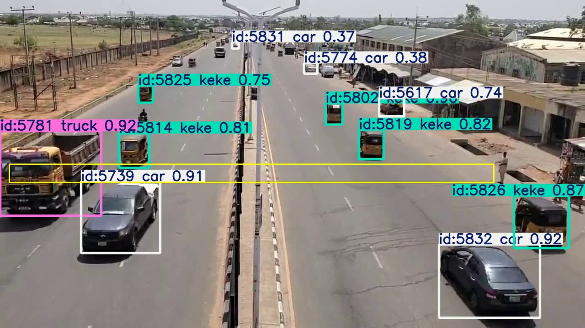
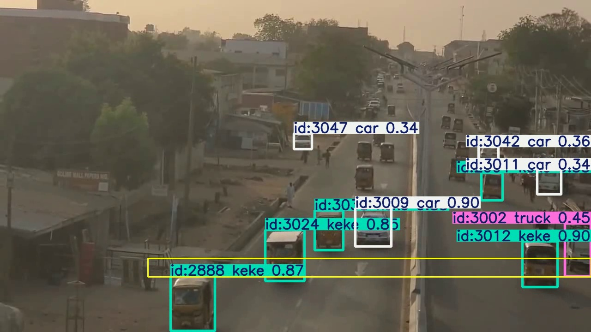

# Keke-Aware-Vehicle-Counting
The dataset, training, inference, and evaluation codes for the "Keke-Aware Vehicle Counting for Traffic Measurement Using YOLO: Dataset and Field Evaluation" research paper.

| Yolo11l-tuned model detection on Yola road | Yolo26l-tuned model detection on Mubi road |
| :---: | :---: |
|  |  |


## Docker setup

This project can be run inside Docker Compose with GPU support for training and evaluation.

### Requirements

- Ubuntu 24.04
- Docker
- Docker Compose
- NVIDIA driver installed and working
- NVIDIA Container Toolkit installed
- A CUDA-capable GPU

### Verify GPU access on the host

Run:

```bash
nvidia-smi
```

If the GPU is detected correctly, Docker should be able to use it.

### Build and start the container

The compose configuration uses the `HOST_UID` and `HOST_GID` values defined in the project `.env` file so files created inside the container are owned correctly on the host system.


Build and start the container:
```bash
sudo docker compose build
sudo docker compose up -d
```

Open a shell inside the container:
```bash
sudo docker compose exec keke-dev bash
```

### Verify GPU access inside the container

Inside the container, run:
```bash
python -c "import torch; print(torch.__version__, torch.cuda.is_available(), torch.cuda.get_device_name(0) if torch.cuda.is_available() else 'no-gpu')"
```

### Train the model

Inside the container, run:
```bash
python train.py --model yolo26l.pt --epochs 100 --imgsz 640 --name train_keke_rev1
```

### Run the traffic counting analysis

Inside the container, run the following for the first test video:
```bash
python vehicle_counter_analysis.py \
  --video-path ./datasets/test/20250627_121728h_yola_road.mp4 \
  --tracker botsort.yaml \
  --region-points "20,400 1080,400 1080,360 20,360" \
  --default-class-filter "2,3,5,7" \
  --default-model "yolo26l.pt" \
  --tuned-model "runs/detect/train_keke_rev1/weights/best.pt" \
  --out-dir "./results/keke_rev1"
```

and the following for the second test video:
```bash
python vehicle_counter_analysis.py \
  --video-path ./datasets/test/20260131_170349h_mubi_road.mp4 \
  --tracker botsort.yaml \
  --region-points "320,600 1280,600 1280,560 320,560" \
  --default-class-filter "2,3,5,7" \
  --default-model "yolo26l.pt" \
  --tuned-model "runs/detect/train_keke_rev1/weights/best.pt" \
  --out-dir "./results/keke_rev1b"
```

### Plot analysis result

Inside the container, run:
```bash
python plot_vehicle_metrics.py \
  --min-duration-s 0.15 \
  --max-duration-s 10.0 \
  --min-avg-conf 0.40 \
  --tuned-segments ./results/keke_rev1/tuned_region_segments.csv \
  --default-segments ./results/keke_rev1/default_region_segments.csv \
  --baseline-segments ./baseline/yola_road_mp4_baseline_vehicle_count.csv \
  --outdir ./results/keke_rev1/plots
```

### Stop the container

From the host terminal:
```bash
sudo docker compose down
```
